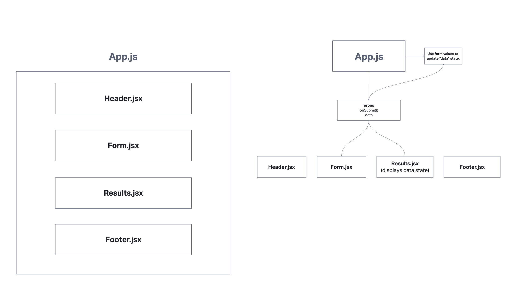

# Resty

[Live Site](https://lucent-cucurucho-acc433.netlify.app/)

This app will allow a user to specify a URL for where they want their data from, then specify a CRUD method. If the user selects PUT/POST then the user will need to give a body so that the app can make an appropriate request

- for lab27 we had to refactor our App into a function and start using state through hooks. Now our form actually passes data up to App in order for App to show it on the screen
